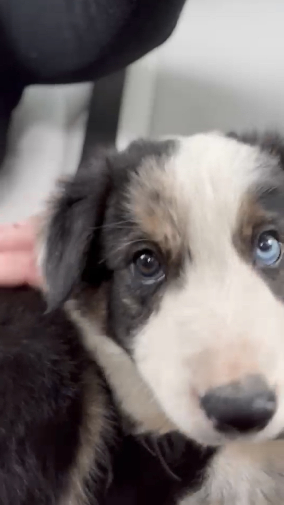

# About Me

[Home](./index)

- I am a Computer Science and Math major at Quinnipiac University, graduating in 2024

I became interested in computer science and programming at a young age, but for a long time between then and college,
I didn't care for it all too much.  However, I took a programming course in my first semester at Quinnipiac, and remembered how much fun
it could be.  About a year later, I doubled a Computer Science major on top of my already declared Math major, and here we are today.

- My programming experience currently is Scala, Java, and Android Development in Java.
- My favorite hobby is watching and playing basketball.  My favorite team is the New York Knicks.  I've also been playing video games since I was a kid.
- I also love music!  I've played trumpet since I was in 4th grade, and also know guitar and piano.

- I have a dog named Chase.  He's about 10 weeks old (as of April 2022).

